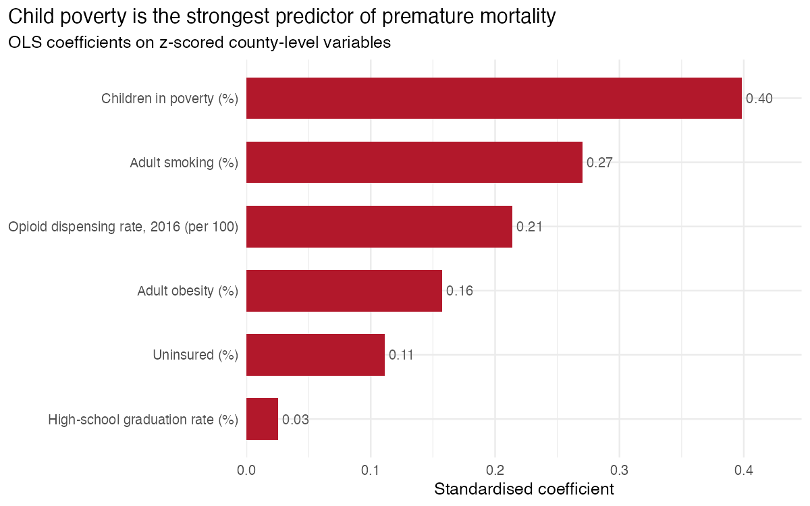
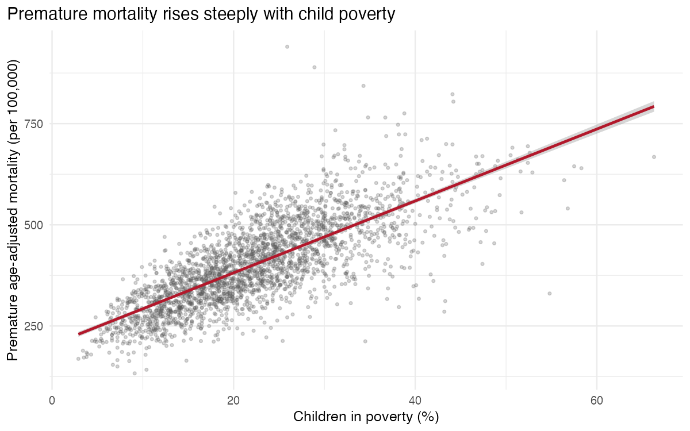
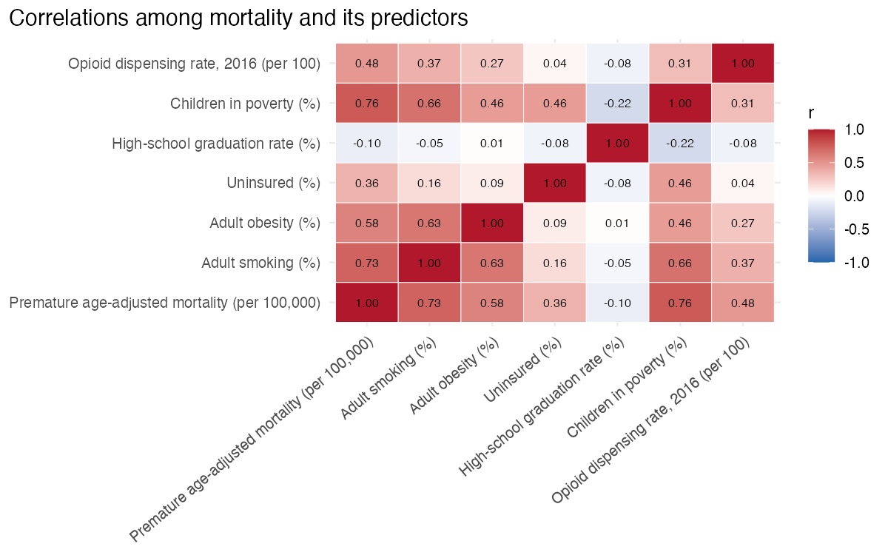

# Predictors of Premature Mortality at the US County Level

[](https://github.com/wangyi1010/premature-mortality-county-analysis/actions/workflows/analysis.yml)
[](LICENSE)
[](https://www.r-project.org/)
[](https://rstudio.github.io/renv/)

A reproducible analysis of the social, behavioural, healthcare-access and
drug-environment factors associated with **premature age-adjusted mortality**
(deaths before age 75) across United States counties.

## Headline finding

Across **2,611 counties**, a six-predictor OLS model explains **73% of the variation**
in premature age-adjusted mortality (R² = 0.732, adjusted R² = 0.731). **Child poverty
is the strongest predictor**, followed by adult smoking and the opioid dispensing rate.
High-school graduation rate — expected to protect against mortality — loses almost all of
its association once socioeconomic and behavioural factors are held constant: a textbook
case of confounding.



| Predictor | Std. coefficient | Direction |
|---|---:|---|
| Children in poverty (%) | **0.40** | ↑ mortality |
| Adult smoking (%) | 0.27 | ↑ mortality |
| Opioid dispensing rate, 2016 | 0.21 | ↑ mortality |
| Adult obesity (%) | 0.16 | ↑ mortality |
| Uninsured (%) | 0.11 | ↑ mortality |
| High-school graduation rate (%) | 0.03 | negligible |

<p align="center">
  
  
</p>

## Research question

What county-level social, behavioural, healthcare-access, and drug-environment factors
are associated with premature age-adjusted mortality in the United States?

## Methods

Descriptive statistics, pairwise correlations, and a multivariate OLS regression with
variance-inflation-factor checks for multicollinearity. The graduation-rate predictor is
examined before and after controls to make the confounding explicit. Results are framed as
**county-level (ecological) associations**, not individual-level causal effects.

## Project structure

```
.
├── R/                       # reusable functions (loaded by report, pipeline and tests)
│   ├── data.R               #   load + merge + clean the raw datasets
│   ├── model.R              #   OLS fit, standardised coefficients, VIF
│   └── plots.R              #   ggplot figure builders
├── scripts/
│   └── run_analysis.R       # end-to-end pipeline → figures + model summary
├── tests/testthat/          # regression tests pinning the headline results
├── data/
│   ├── raw/                 # original datasets (see data/README.md for provenance)
│   └── README.md
├── outputs/
│   ├── figures/             # generated PNGs (also embedded above)
│   └── model_summary.txt    # generated text summary of the model
├── report.Rmd               # narrative report; sources R/ so there is one implementation
├── report.pdf               # rendered report (regenerated in CI)
├── renv.lock                # pinned package versions for reproducibility
├── DESCRIPTION              # declared dependencies
└── Makefile                 # make deps | analysis | report | test
```

Data loading, cleaning and modelling live in `R/` and are shared by the report, the
pipeline script and the tests — so there is a single source of truth and the tests
actually guard the numbers quoted above.

## Reproduce

```bash
make deps       # restore pinned packages from renv.lock
make analysis   # regenerate figures + model summary in outputs/
make report     # knit report.Rmd to report.pdf  (needs a LaTeX install, e.g. TinyTeX)
make test       # run the testthat suite
```

Or directly in R:

```r
renv::restore()
source("scripts/run_analysis.R")
testthat::test_dir("tests/testthat")
rmarkdown::render("report.Rmd")
```

Continuous integration (`.github/workflows/analysis.yml`) runs the tests, regenerates the
figures, and re-renders the report on every push.

## Data sources

| Dataset | Provider | Source |
|---|---|---|
| County Health Rankings 2018 (outcome + 5 predictors) | Robert Wood Johnson Foundation & University of Wisconsin Population Health Institute | <https://www.countyhealthrankings.org/> |
| County opioid dispensing rate, 2016 | U.S. Centers for Disease Control and Prevention | <https://www.cdc.gov/drugoverdose/rxrate-maps/> |

Both datasets are publicly released by their providers and are included under `data/raw/`
only to make the analysis self-contained. All rights remain with the original providers;
see [`data/README.md`](data/README.md) for full provenance.

## License

Code and write-up are released under the [MIT License](LICENSE). The bundled datasets
belong to their respective providers (see above) and are not covered by that license.
